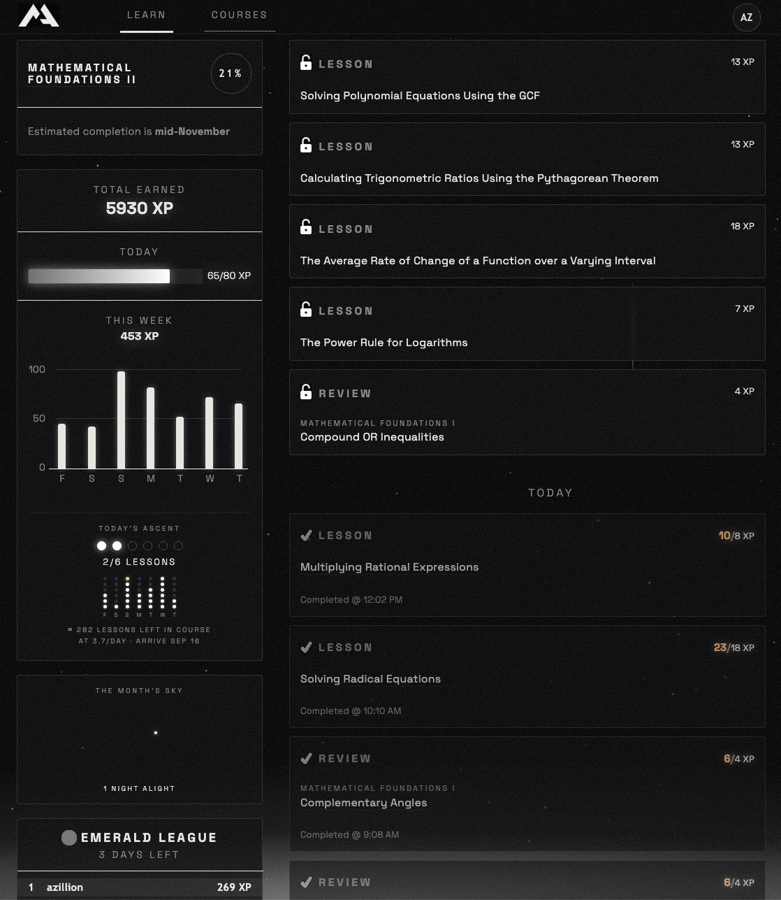

# MA Styled

A personal Chrome extension that restyles [Math Academy](https://mathacademy.com)
as pointillist, futurist hope core: a stippled void, wide-tracked luminous
typography, a starfield behind the content — and a dawn on the horizon that
rises as you earn your daily XP.

The aesthetic draws on 1-bit stipple/dither illustration and pointillist
sci-fi art — among the references was a galaxy piece by Dogan Ural
(`doganuraldesign`); the artwork itself is not redistributed here.

## Install

1. Open `chrome://extensions`
2. Enable **Developer mode** (top right)
3. **Load unpacked** → select this folder

Click the toolbar icon to toggle the theme, starfield, dawn, grain, HUD, and
motion individually.

## Structure

| Path | What it is |
| --- | --- |
| `src/theme.css` | The theme. Scoped under `html.mas`; palette and progress live in CSS variables on `html.mas`. |
| `src/early.js` | Runs at `document_start`; flips `html.mas` + feature flags from `chrome.storage.sync` before first paint. |
| `src/content.js` | Starfield canvas, dawn element, HUD microcopy, completion celebrations, XP → `--mas-progress`. |
| `popup/` | Toolbar popup with feature toggles. |
| `fonts/` | Bundled [Space Grotesk](https://fonts.google.com/specimen/Space+Grotesk) variable font (300–700) by Florian Karsten, licensed under the [SIL Open Font License 1.1](https://openfontlicense.org). |
| `server/` | Optional private sync server (Cloudflare Worker + KV). |

## Scope

The extension only runs on **`/learn*` and `/courses/*`** (manifest match
patterns). Task/lesson pages are deliberately untouched so nothing can ever
interfere with math rendering mid-lesson.

## Site wiring

Selectors are confirmed against the real `/learn` DOM (July 2026):

- **The daily mission is lessons, not XP**: `LESSON_GOAL = 6` new lessons
  a day (reviews/quizzes/assessments don't count). Today's count comes
  from `#completedTasks` cards whose hidden `input.taskCompletedDate` is
  "Today" and whose type span is "Lesson". The dawn rises on
  lessons-done/6 (carried across pages via `sessionStorage`) and turns
  **warm gold** at 6/6.
- A mission widget in the sidebar XP card shows six dots that light up
  per lesson, a 7-day dot chart, "≈ N lessons left in course", and an
  arrival date projected from your own 7-day lesson pace.
- **The remaining count calibrates on the progress page**
  (`/courses/{id}/progress`) — the site's only per-topic view. Counting
  the white (not-yet-started) `.topicCircle`s gives an exact remaining;
  each visit stores a course-scoped anchor (`masMarks.anchors`, keyed by
  the sidebar's `.selectedCourse` name), decremented by exact daily
  lesson counts between visits. Anchors are timestamped, newest-wins in
  merges, and free to move in **both** directions — so a bad reading heals
  on the next visit, and one course's page can never poison another's
  count. Without an anchor the model falls back to the dashboard unit
  bars (per unit: topics × the white segment width, min-clamped against
  history — the legacy path; visit the progress page once to escape it).
- The site only changes on reload, so celebrations fire on load: today's
  lesson count is remembered in `localStorage`, and returning with more
  lessons sends one rising light streak per new lesson up from the
  mission widget — lessons beyond the goal rise warm.

## Cross-browser sync

History and marks sync across browsers/machines through a private
Cloudflare Worker — see `server/README.md` for the 5-minute deploy. Paste
the worker URL + token into the popup's Sync fields in each browser. The
sync is one `PUT /state` per dashboard load; the server merges with the
same monotonic rules the client uses, and the round-trip completes before
celebrations fire so events never repeat across browsers. No config or no
network → everything just stays local.

## The long game

`chrome.storage.local` keeps a per-day history (`masHistory`), backfilled
from the dashboard's visible completed-days list, plus one-time marks
(`masMarks`). It powers:

- **The sky fills as the course empties** — starfield density scales with
  course completion; every lesson permanently brightens the void. Lessons
  beyond today's goal each add a bright warm star to the session sky.
- **The month's sky** — a sidebar constellation: one star per day with
  lessons, goal-met days shine bright, and consecutive goal-met days are
  joined by constellation lines. Streaks read as connected stars, missed
  days as gaps — no guilt-flames.
- **The traveler** — a tiny figure fixed on the horizon, walking from the
  left edge toward the dawn as the course completes.
- **Unit summits** — the first time a unit's lessons are all done: a
  meteor shower and a HUD line (`TRIGONOMETRY BEHIND YOU · 8 REMAIN`).
  Seeded silently on first run so past progress doesn't celebrate itself.
- **Decile flares** — each new tenth of the course completed surges the
  dawn for a few seconds (`ONE TENTH CLOSER TO THE SUN`).
- **Weekly transmission** — first load of each week: a dismissable panel
  with last week's lessons, days alight, and brightest day.
- **The voyage** — course catalog pages (`/courses/{slug}`) get a shore
  dock showing that course's size in lessons and days at your pace, with a
  `CHART COURSE` button. Charted courses become an itinerary card on the
  dashboard with cumulative arrival dates. Entries carry timestamps so
  un-charting merges cleanly across browsers. Catalog totals are outer
  bounds — Math Academy's diagnostic typically shrinks them.
- **Leagues, renamed** — the gem tiers become an ascent from darkness:
  The Void → Ember → Spark → Starlight → Constellation → Moonrise →
  Horizon → Dawn → The Sun, with dots on a matching brightness ladder.
- Unit progress bars use inline-styled cells with a blue scale for
  repetition depth — the theme remaps them **by inline color** (so it works
  on every page that draws them) to a white-alpha scale: light literally
  fills the bar in as you learn.
- Monochrome conversions of the site's colors/icons: green checkmarks →
  white light, leaderboard promotion/demotion → bright/dim instead of
  green/red (zone arrow icons hidden), league dots → grayscale, expander
  icons → inverted.

Handy while iterating: `masAscend(el)` in the devtools console fires the
rising-light celebration on any element.

Known rough edge: the knowledge-graph popup (`#graph`) is an inline SVG with
hardcoded white background and blue nodes — left unstyled for now.

## Notes

- Math rendering (MathJax/KaTeX) is deliberately untouched: fonts are set via
  inheritance from `body`, which explicit math fonts override naturally.
- The grain overlay uses `mix-blend-mode: screen`, so it only ever lightens —
  it can't darken text into the background.
- `prefers-reduced-motion` and the Motion toggle disable twinkle, streaks,
  and beams.
